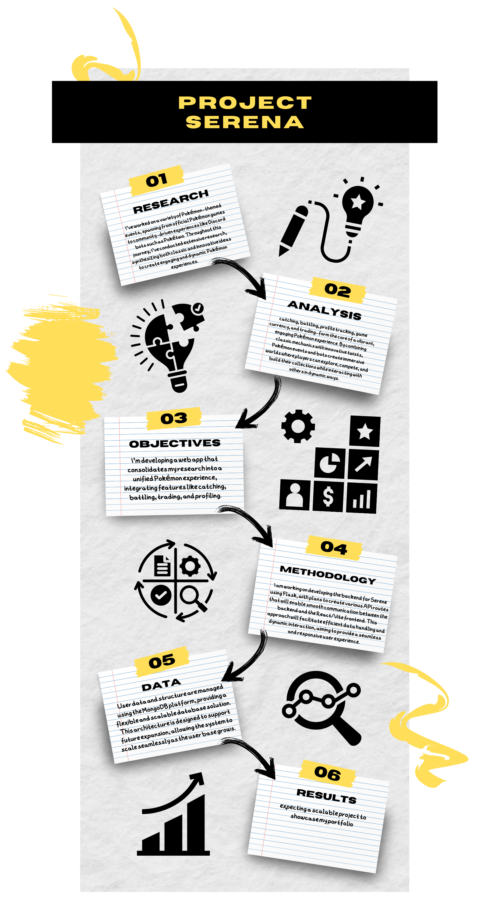

# Project Serene

**Serene** is an interactive web-based platform inspired by Pokémon-style gameplay. The project combines a rich profile system with engaging mechanics such as catching creatures, battling, and trading with in-game currency. Players will be able to create and customize profiles, embark on adventures to catch creatures, and battle them in various arenas. 

The trading system allows players to exchange creatures and resources using the in-game currency, while the market feature enables purchasing upgrades, items, and more to enhance their gameplay experience.

## Key Features:

- **Profile Creation**: Each player has a unique profile showcasing their caught creatures, battle stats, and achievements.
- **Catching Creatures**: Explore different environments to catch various creatures, each with their own strengths and abilities.
- **Battling**: Engage in real-time or turn-based battles against other players or NPCs.
- **Trading and Currency**: Use in-game currency for trading creatures and purchasing items from the in-game market.
- **Market System**: Buy and sell items, upgrades, and even creatures.

As the project expands, additional features like events, quests, and more complex battling mechanics may be introduced.

## vision -> Roadmap!
